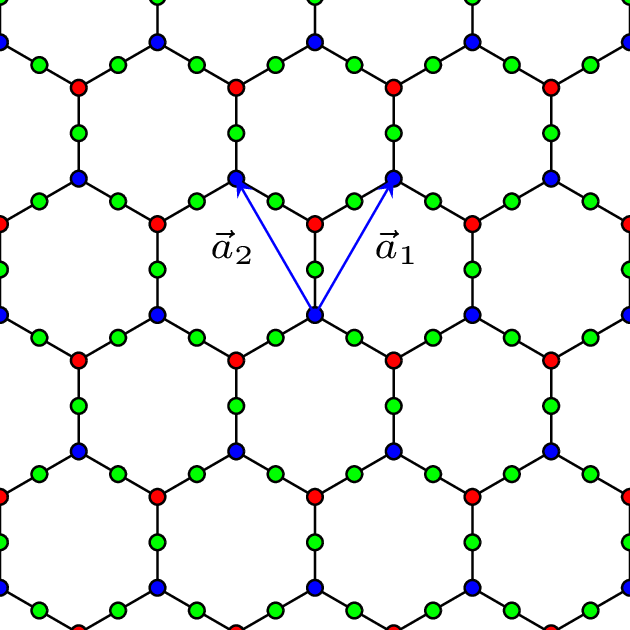
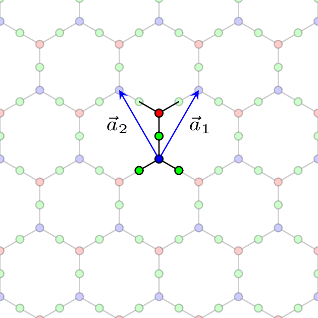

You can easily compile these standalone images with `pdflatex`, e.g.:

`pdflatex example.tex`

To produce a PNG image in linux, use ImageMagick's `convert` command, e.g.:

`convert -density 400 -quality 90 example.pdf images/example.png`

## Example outputs:

|  |
|:--:|
| *Honeycomb-Kagome lattice* |

|  |
|:--:| 
| *Honeycomb-Kagome unit cell* |
